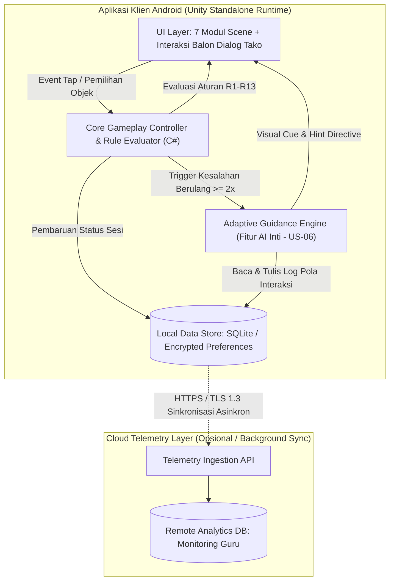

# HIGH-LEVEL DESIGN (HLD)
## Game Edukasi *Daily Life* Berbasis Decision Tree & Adaptive Guidance System

---

## 1. Ringkasan Eksekutif & Asumsi Desain

Dokumen High-Level Design (HLD) ini merinci arsitektur perangkat lunak untuk Game Edukasi *Daily Life*, yang ditujukan bagi anak disabilitas intelektual (tunagrahita). Desain ini disusun langsung berdasarkan dokumen PRD, SRS, dan User Story yang telah ditetapkan, dengan mempertimbangkan batasan prototipe 1 semester, satu fitur AI inti, serta biaya operasional minimal (*zero to minimal cost*).

### Daftar Asumsi Arsitektur
* **[ASUMSI-01]:** Aplikasi beroperasi secara utama dalam mode luring (*offline-first / standalone*) pada perangkat tablet atau *smartphone* Android untuk mengantisipasi keterbatasan jaringan di lingkungan sekolah luar biasa (SLB).
* **[ASUMSI-02]:** Fitur AI inti (US-06A & US-06B: analisis pola kesalahan dan bimbingan adaptif) diimplementasikan secara tersemat (*embedded/on-device*) di dalam mesin aplikasi untuk menjamin latensi respon di bawah target batas kritis ($< 3$ detik) tanpa biaya komputasi server eksternal.
* **[ASUMSI-03]:** Sistem otentikasi identitas tidak membebani siswa; otentikasi hanya diterapkan pada tingkat konfigurasi guru/pendamping menggunakan mekanisme proteksi PIN lokal sederhana.
* **[ASUMSI-04]:** Data profil siswa tidak memuat Informasi Teridentifikasi Pribadi (PII) sensitif dan hanya menggunakan pengidentifikasi pseudonim lokal (*Session/Profile UUID*).

---

## 2. Diagram Arsitektur Sistem

Sistem mengadopsi pola *edge-first architecture*, di mana seluruh logika alur permainan, evaluasi aturan sekuensial, dan modul komputasi bimbingan adaptif dieksekusi secara lokal pada *runtime* klien. Lapisan layanan *cloud* diposisikan sebagai saluran telemetri asinkron opsional.

### 2.1 Diagram Alur Blok Tingkat Tinggi (ASCII)

```text
┌─────────────────────────────────────────────────────────────────────────┐
│                     ANDROID CLIENT RUNTIME (UNITY)                      │
│                                                                         │
│  [ UI Layer / Scene Views ]                                             │
│    ├── 7 Modul Aktivitas (Bangun Tidur s.d. Pamitan)                    │
│    └── Karakter Tako (Dialog Feedback & Visual Cue Renderer)            │
│                                │                                        │
│                                ▼                                        │
│  [ Core Gameplay Controller & Rule Engine ]                             │
│    ├── Decision Tree Evaluator (Aturan R1 s.d. R13)                     │
│    └── Scene Flow & State Manager (LoadNextActivity)                    │
│         │                                        │                      │
│         ▼ (Jika Terjadi Pola Salah >= 2x)        ▼                      │
│  [ Adaptive Guidance Engine (Fitur AI) ]  [ Local Data Store ]          │
│    ├── Error Pattern Counter & Sanitizer   ├── SQLite / Encrypted Prefs │
│    ├── On-Device Decision Tree Inferrer    └── Game State & Log Sesi    │
│    └── Circuit Breaker & Fallback Logic                                 │
└───────────────────────────────────┬─────────────────────────────────────┘
                                    │ (Asinkron / Opsional via HTTPS)
                                    ▼
       ┌────────────────────────────────────────────────────────┐
       │      EXTERNAL / CLOUD TELEMETRY (OPSIONAL / ROADMAP)   │
       │                                                        │
       │  [ Ingestion API Gateway ] (FastAPI / Node.js)         │
       │  [ Cloud Analytics Store ] (PostgreSQL / Supabase)     │
       └────────────────────────────────────────────────────────┘
```

### 2.2 Diagram Relasi Komponen (Mermaid)



---

## 3. Deskripsi Komponen & Trade-Off Keputusan

### 3.1 Peran dan Tanggung Jawab Komponen

| Komponen | Peran & Tanggung Jawab | Teknologi Usulan |
| :--- | :--- | :--- |
| **UI Layer & Presentation** | Menampilkan 7 modul aktivitas harian secara visual, mengelola interaksi sentuhan tunggal (*single-tap*), merender dialog teks pemandu Tako, serta menyajikan efek visual (*glow/pointer*). | Unity Engine (UGUI, TextMeshPro, C#) |
| **Gameplay Controller & Rule Engine** | Mengatur transisi *state machine* antaraktivitas, memvalidasi input terhadap pohon keputusan deterministik (`R1` s.d. `R13`), dan memanggil transisi `LoadNextActivity` atau `ShowFeedback`. | C# State Pattern / ScriptableObject Architecture |
| **Adaptive Guidance Engine (Fitur AI Inti)** | Menganalisis frekuensi dan pola kesalahan berulang ($\ge 2\times$), mengukur tingkat kesulitan, menghitung *confidence score*, serta menentukan tingkat intervensi bimbingan adaptif Tako. | C# Embedded Decision Logic / On-Device Rule Inferrer |
| **Local Data Store** | Menyimpan status penyelesaian modul, counter kesalahan sesi aktif, preferensi aksesibilitas, dan riwayat telemetri secara lokal tanpa dependensi koneksi luar. | SQLite (via `Mono.Data.Sqlite`) / Local Encrypted Storage |
| **Telemetry Gateway & Cloud Store (Opsional)** | Saluran penampung data berkala untuk evaluasi guru terkait perkembangan anak. Tidak memblokir alur permainan utama. | REST API (FastAPI / Supabase Free Tier) |

### 3.2 Tabel Trade-Off Keputusan Arsitektur AI

Keputusan arsitektur terkait penempatan mesin inferensi bimbingan adaptif:

| Kriteria Evaluasi | On-Device Logic (Embedded C# Engine) | Cloud API (Managed LLM / API Eksternal) | Self-Hosted VM (Server Model Mandiri) |
| :--- | :--- | :--- | :--- |
| **Akurasi** | **Tinggi & Deterministik (100% konsisten)** | Menengah (probabilistik, risiko halusinasi konteks) | Menengah – Tinggi (tergantung tuning model) |
| **Latensi** | **Sangat Cepat ($< 50$ ms)** | Menengah – Lambat (500 ms – 3000 ms, tergantung sinyal) | Lambat – Menengah (antrean antarmuka & koneksi) |
| **Biaya** | **Rp0 (Nol Rupiah, komputasi lokal perangkat)** | Variabel (biaya konsumsi token API berjalan) | Tinggi (biaya sewa server/GPU bulanan tetap) |
| **Privasi** | **Maksimal (data anak tidak pernah keluar)** | Berisiko (data interaksi transit ke server pihak ketiga) | Terkendali (infrastruktur privat, butuh *maintenance*) |
| **Effort** | **Sangat Rendah (cocok untuk 1 semester)** | Menengah (integrasi SDK REST, penanganan *network fail*) | Sangat Tinggi (pengelolaan VM, Docker, *runtime*, OOM) |

* **Keputusan Arsitektur:** Memilih **On-Device Logic (Embedded C# Engine)**.
* **Alasan:** Memenuhi batasan utama SRS/PRD yang mewajibkan sistem *standalone* dengan respon transisi cepat tanpa ketergantungan internet, sekaligus menghilangkan biaya infrastruktur server secara total. Alternatif *Cloud API* dan *Self-Hosted VM* ditolak karena konektivitas sekolah mitra sering kali fluktuatif, yang berisiko menyebabkan *freeze/timeout* serta membingungkan pengguna anak berkebutuhan khusus.

---

## 4. Aliran Data End-to-End Fitur AI (Adaptive Guidance)

Alur penanganan kesalahan berulang hingga penyajian umpan balik visual terarah mencakup mekanisme pengamanan dan *fallback*:

```text
[1. Input Pengguna]
Siswa memilih objek/tindakan pada layar modul permainan
       │
       ▼
[2. Preprocessing & Event Validation]
Validasi sentuhan pada area sah & periksa format log histori sesi lokal
       │
       ├─── [Data Korup / Tidak Terbaca] ─────────> [TITIK FALLBACK 1: Reset Context]
       │                                            Gunakan petunjuk statis standar (R2/R4/R6/R8/R10/R13)
       ▼ (Data Valid)
[3. State Evaluation & Counter Aggregation]
Sistem menghitung total akumulasi kesalahan pada modul aktif saat ini
       │
       ├─── [Kesalahan < 2x] ────────────────────> Eksekusi dialog koreksi umum Tako (Normal Path)
       │
       ▼ [Kesalahan >= 2x]
[4. Inference: Adaptive Engine Execution]
Analisis pola modul, frekuensi repetisi, dan kalkulasi Confidence Score (Target <= 3 detik)
       │
       ├─── [Timeout Pemrosesan > 3 detik] ──────> [TITIK FALLBACK 2: Cut-Off Timer]
       │                                            Batalkan antrean, alihkan ke petunjuk statis
       ▼
[5. Postprocessing & Decision Routing]
       │
       ├─── [Confidence Score >= 75%] ────────────> Terapkan Bimbingan Visual Terarah Spesifik
       │                                            (Efek Glow / Tangan Tako menunjuk objek benar)
       │
       └─── [Confidence Score < 75%] ─────────────> [TITIK FALLBACK 3: Low Confidence Mitigation]
                                                    Sajikan petunjuk dasar sederhana & minta coba ulang
       │
       ▼
[6. Output Presentation]
Animasi karakter Tako berpikir selesai; instruksi visual/verbal adaptif muncul di layar
       │
       ▼
[7. Persistence]
Simpan riwayat intervensi, modul ID, dan waktu respon ke basis data lokal
```

---

## 5. Kontrak Antarkomponen Tingkat Tinggi

Karena sistem beroperasi secara *on-device*, kontrak komponen dirancang menggunakan struktur pesan antarmuka internal (*in-engine contract*), yang kompatibel untuk diekspos sebagai skema JSON jika integrasi API telemetri diaktifkan di masa depan.

### 5.1 Event Trigger Evaluasi Interaksi
* **Event Name:** `OnModuleActionEvaluated`
* **Trigger:** Pengguna melakukan ketukan/seleksi objek pada salah satu dari 7 modul aktivitas.

### 5.2 Skema Data Masukan (Request Payload)
```json
{
  "session_id": "550e8400-e29b-41d4-a716-446655440000",
  "module_id": "MOD-05-PREPARE-BOOKS",
  "attempt_count": 3,
  "selected_object_id": "ITEM_COMIC_BOOK",
  "expected_object_id": "ITEM_TEXTBOOK",
  "elapsed_seconds": 8.45
}
```

### 5.3 Skema Respons Bimbingan Adaptif Normal (`Confidence Score >= 75%`)
```json
{
  "status": "SUCCESS",
  "inference_latency_ms": 18,
  "confidence_score": 0.89,
  "assistance_tier": "DIRECT_VISUAL_CUE",
  "presentation_directive": {
    "tako_dialog_key": "TAKO_HINT_PREPARE_BOOKS_LEVEL2",
    "target_highlight_id": "ITEM_TEXTBOOK",
    "visual_effect": "PULSE_GLOW_HIGHLIGHT",
    "trigger_audio_repeat": true
  },
  "is_fallback": false
}
```

### 5.4 Skema Respons Penanganan Cadangan (`Fallback / Timeout / Corrupted Data`)
```json
{
  "status": "DEGRADED_FALLBACK",
  "inference_latency_ms": 2,
  "confidence_score": 0.0,
  "assistance_tier": "GENERAL_STATIC_HINT",
  "presentation_directive": {
    "tako_dialog_key": "TAKO_DEFAULT_RETRY_MESSAGE",
    "target_highlight_id": null,
    "visual_effect": "NONE",
    "trigger_audio_repeat": false
  },
  "is_fallback": true,
  "fallback_reason": "PROCESSING_TIMEOUT_OR_LOW_CONFIDENCE"
}
```

---

## 6. Penempatan Security & Privacy by Design

* **Autentikasi & Otorisasi:**
  * Area permainan siswa tidak memerlukan kredensial login rumit untuk mencegah hambatan kognitif.
  * Menu reset data dan evaluasi guru diproteksi dengan mekanisme PIN lokal 4 digit (*Parental/Teacher Gate*).
* **Prinsip Minimalisasi Data & Privasi Sensitif:**
  * Sistem tidak mengumpulkan data pribadi siswa seperti nama lengkap, NIK, tanggal lahir, maupun data medis disabilitas.
  * Identifikasi profil belajar sepenuhnya menggunakan pseudonim (*Local Profile ID*).
* **Enkripsi Data (Data at Rest):**
  * Berkas penyimpanan riwayat sesi dan metrik kesalahan pada *Local Data Store* dienkripsi secara simetris menggunakan AES-128 guna mencegah manipulasi atau pembacaan berkas secara langsung di perangkat Android.
* **Enkripsi Transit (Data in Transit - Khusus Telemetri Opsional):**
  * Seluruh pengiriman telemetri latar belakang diwajibkan menggunakan protokol HTTPS dengan standar TLS 1.3 dan verifikasi sertifikat.
* **Logging & Audit Trail:**
  * Berkas log aplikasi hanya mencatat transisi status sistem, durasi per modul, frekuensi kesalahan, dan penanganan galat.
  * Dilarang keras merekam masukan suara latar, tangkapan layar dinamis, atau rekaman koordinat sentuhan di luar objek game resmi.

---

## 7. Lingkungan Deployment (Deployment Environments)

| Parameter | Development (Lokal) | Staging (Evaluasi Mitra SLB) | Production (Prototipe Akhir) |
| :--- | :--- | :--- | :--- |
| **Tujuan** | Pengembangan fitur, perancangan skenario *scene*, dan pengujian logika aturan. | Validasi fungsional *Black Box* dan pengujian kegunaan bersama guru pendamping. | Demonstrasi prototipe akhir semester dan evaluasi hasil belajar mandiri. |
| **Lingkungan Runtime** | Unity Editor LTS (PC/Mac) + Android Virtual Device (AVD). | Perangkat tablet Android fisik di sekolah mitra (YBPK Semampir Kediri). | Tablet Android target yang telah terpasang paket rilis stabil. |
| **Format Artefak** | Editor Playmode & APK Debug lokal. | Android Application Package (APK) ditandatangani *keystore staging*. | Android App Bundle (AAB) / Standalone Release APK teroptimasi. |
| **Konfigurasi Logging** | Verbose (semua *trace* C# aktif di konsol Unity). | Warning & Error Only (pencatatan insiden galat lokal). | Disabled / Critical Fatal Only (optimasi performa dan memori). |
| **AI Fallback Test** | Simulasi injeksi input data korup dan jeda komputasi artifisial ($> 3$ dtk). | Pengujian stabilitas saat jaringan dinonaktifkan (mode pesawat). | Modul berjalan penuh secara lokal (*air-gapped* aman). |

---

## 8. Penelusuran Kebutuhan Sistem (Traceability Matrix)

| Kode Kebutuhan (SRS / US) | Komponen Terkait HLD | Mekanisme Penyelesaian |
| :--- | :--- | :--- |
| **FR-01, US-01** | UI Layer (Tako Presentation) | Pemuatan aset pembuka cerita dan inisialisasi dialog perkenalan maskot Tako. |
| **FR-02, US-02A/B/C** | UI Layer & Gameplay Controller | Implementasi modular 7 *scene* rutinitas pagi (Bangun Tidur hingga Pamitan). |
| **FR-03, FR-04, US-03, US-04** | Core Rule Engine (Decision Tree) | Evaluasi deterministik aturan logika `R1` s.d. `R13` dan pemanggilan `LoadNextActivity`. |
| **FR-05, US-05** | UI Layer & Rule Engine | Eksekusi umpan balik koreksi Tako dan mempertahankan pemain di *scene* aktif. |
| **FR-06, FR-07, US-07, US-08** | Core Rule Engine & UI Layer | Evaluasi modul sarapan (`R11`), modul pamitan (`R12`), dan penutupan status selesai. |
| **US-06A, US-06B (Fitur AI)** | Adaptive Guidance Engine | Pencatatan pola kesalahan $\ge 2\times$, kalkulasi *confidence*, dan arahan visual adaptif. |
| **NFR Usability & Performance** | Architecture & Deployment | Operasional *on-device* dengan transisi instan ($\le 1,5$–$2$ detik) dan nol latensi server. |
| **NFR Reliability & Fallback** | Adaptive Guidance Engine | Tri-level *fallback*: penanganan data korup, *timeout* 3 detik, dan mitigasi skor ragu. |