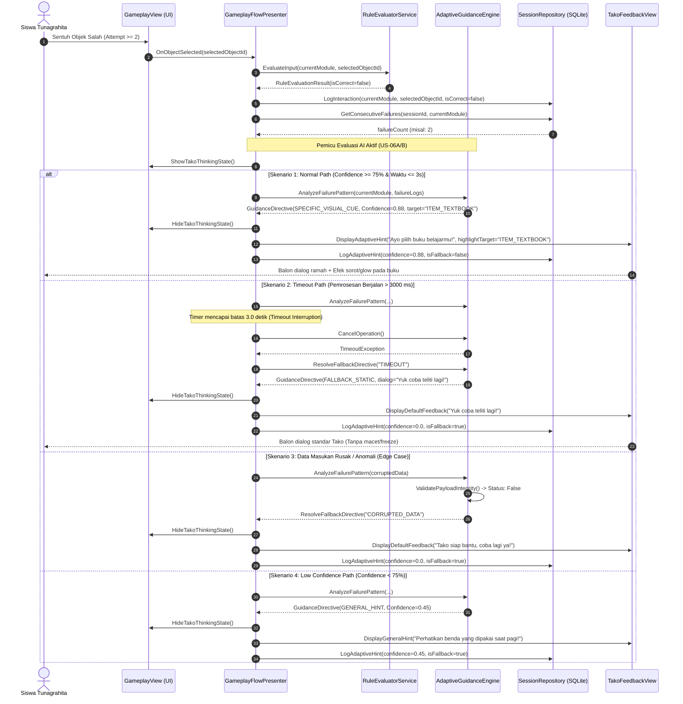

# DOKUMEN LOW-LEVEL DESIGN (LLD)
## Fitur Inti & Adaptive Engine – Game Edukasi *Daily Life*

---

### 1. Desain Modul & Class (Detailed Class Design)

Pola desain yang digunakan memisahkan logika bisnis (*Plain Old C# Objects* / POCO) dari layer visual Unity (`MonoBehaviour`) mengikuti pendekatan Model-View-Presenter (MVP) / Clean Architecture.

```text
┌─────────────────────────────────────────────────────────────┐
│                         PRESENTATION                        │
│   GameplayView (MonoBehaviour)  │  TakoFeedbackView (Mono)  │
└──────────────────────────────┬──────────────────────────────┘
                               │ Event/Interface
┌──────────────────────────────▼──────────────────────────────┐
│                         CONTROLLER                          │
│                  GameplayFlowPresenter                      │
└──────────────────────────────┬──────────────────────────────┘
                               │ Panggil Service & Use Cases
┌──────────────────────────────▼──────────────────────────────┐
│                          DOMAIN                             │
│   RuleEvaluatorService  │  AdaptiveGuidanceEngine (AI)      │
└──────────────────────────────┬──────────────────────────────┘
                               │ Abstraksi Repository
┌──────────────────────────────▼──────────────────────────────┐
│                           DATA                              │
│       SessionRepository │ SQLiteDbContext (On-Device)       │
└─────────────────────────────────────────────────────────────┘
```

#### A. `RuleEvaluatorService` (Domain Logic – Evaluasi Keputusan Deterministik)
* **Tanggung Jawab:** Menguji kecocokan input interaksi pemain terhadap matriks aturan linier $R_1$ hingga $R_{13}$ tanpa bergantung pada Unity API.
* **Atribut Kunci:**
  * `currentModule: ModuleType` (Enum: `WakeUp`, `Bathing`, `BrushingTeeth`, `WearingUniform`, `PreparingSchoolSupplies`, `Breakfast`, `Farewell`).
  * `ruleCatalog: IReadOnlyDictionary<ModuleType, RuleDefinition>` (Peta aturan validasi per modul).
* **Method Utama:**
  * `EvaluateInput(ModuleType module, string selectedObjectId): RuleEvaluationResult`  
    *Penjelasan:* Membandingkan ID objek yang disentuh pengguna dengan daftar target valid pada modul aktif. Mengembalikan status sukses beserta ID scene berikutnya (`LoadNextActivity`) atau status salah (`ShowFeedback`).
  * `GetExpectedObjectId(ModuleType module): string`  
    *Penjelasan:* Mengambil ID objek yang benar untuk modul terkait (digunakan oleh modul bantuan/hint visual).

#### B. `AdaptiveGuidanceEngine` (Domain Logic – Fitur AI: US-06A & US-06B)
* **Tanggung Jawab:** Memvalidasi log riwayat interaksi, menghitung pola kesalahan repetitif ($\ge 2$ kali pada modul yang sama), menghitung skor keyakinan (*confidence*), dan menentukan tingkat bantuan adaptif.
* **Atribut Kunci:**
  * `consecutiveFailureThreshold: int = 2` (Ambang batas pemicu bimbingan khusus).
  * `confidenceCutoffScore: float = 0.75f` (Ambang batas keyakinan $\ge 75\%$).
  * `processingTimeoutMs: int = 3000` (Batas waktu eksekusi inferensi maksimal 3000 ms).
* **Method Utama:**
  * `AnalyzeFailurePattern(string sessionId, ModuleType module, int attemptCount, List<InteractionLogEntry> sessionLogs): GuidanceDirective`  
    *Penjelasan:* Menerima jejak input pengguna, menyaring integritas log, dan memetakan aksi bimbingan terbaik (apakah memberikan petunjuk visual spesifik *Glow Effect* atau petunjuk umum).
  * `ResolveFallbackDirective(string fallbackReason): GuidanceDirective`  
    *Penjelasan:* Mengembalikan arahan statis baku dari Tako jika terjadi galat data korup, *timeout*, atau *confidence* rendah.

#### C. `GameplayFlowPresenter` (Application / Presentation Controller)
* **Tanggung Jawab:** Mengorkestrasi interaksi pemain dari `IGameplayView`, memanggil `RuleEvaluatorService`, mencatat status ke `ISessionRepository`, dan memicu respons tampilan dialog `TakoFeedbackView`.
* **Atribut Kunci:**
  * `view: IGameplayView` (Kontrak abstraksi tampilan permainan).
  * `takoView: ITakoFeedbackView` (Kontrak dialog dan efek visual maskot Tako).
  * `ruleEvaluator: RuleEvaluatorService`
  * `adaptiveService: AdaptiveGuidanceEngine`
  * `sessionRepo: ISessionRepository`
  * `activeSession: GameSession`
* **Method Utama:**
  * `OnObjectSelected(string objectId): void`  
    *Penjelasan:* Dipanggil saat pemain mengetuk objek; memvalidasi status, mengevaluasi aturan, mencatat log, dan menentukan apakah transisi scene atau menampilkan umpan balik.
  * `HandleEvaluationFailure(ModuleType module, string objectId): void`  
    *Penjelasan:* Mengelola peningkatan *counter* kesalahan, menjalankan inferensi AI adaptif, serta memerintahkan `takoView` menampilkan dialog koreksi dan efek visual.

#### D. Keputusan Pilihan Library Internal (Presenter & Injector)
> **Pilihan Arsitektur Dependency Injection di Unity:**
> * *Opsi A:* **Extenject (Zenject)** — Sangat matang, fitur lengkap (binding, factory), standar industri untuk game Unity berskala besar, namun kurva belajar relatif tinggi untuk durasi 1 semester.
> * *Opsi B:* **VContainer** — Sangat ringan (*zero allocation* saat resolve), performa eksekusi lebih cepat pada perangkat Android, arsitektur sederhana dan mudah dipahami dalam 1 semester.
> 
> **Kriteria Pemilihan:** Performa memori rendah pada perangkat Android target serta kecepatan adopsi implementasi tim selama 1 semester.
> 
> **[KEPUTUSAN TIM: Opsi B - VContainer]** *(atau Opsi A jika tim sudah terbiasa dengan Zenject)*.

---

### 2. Skema Data (Data Schema)

Penyimpanan lokal menggunakan SQLite di perangkat Android (`Application.persistentDataPath/daily_life_game.db`).

#### A. Diagram Hubungan Entitas (Entity-Relationship Text)
```text
┌─────────────────────────┐       1:N       ┌──────────────────────────────┐
│       GAME_SESSION      ├─────────────────┤       INTERACTION_LOG        │
├─────────────────────────┤                 ├──────────────────────────────┤
│ PK  session_id (TEXT)   │                 │ PK  log_id (INTEGER AUTO)    │
│     device_pseudo_id    │                 │ FK  session_id (TEXT)        │
│     started_at (TEXT)   │                 │     module_type (TEXT)       │
│     completed_at (TEXT) │                 │     selected_object_id (TEXT)│
│     is_completed (INT)  │                 │     is_correct (INTEGER)     │
└─────────────────────────┘                 │     attempt_index (INTEGER)  │
                                            │     timestamp (TEXT)         │
                                            └──────────────┬───────────────┘
                                                           │ 1:1
                                            ┌──────────────┴───────────────┐
                                            │       ADAPTIVE_HINT_LOG      │
                                            ├──────────────────────────────┤
                                            │ PK  hint_id (INTEGER AUTO)   │
                                            │ FK  log_id (INTEGER)         │
                                            │     confidence_score (REAL)  │
                                            │     directive_type (TEXT)    │
                                            │     is_fallback (INTEGER)    │
                                            │     execution_time_ms (INT)  │
                                            └──────────────────────────────┘
```

#### B. Skema SQLite DDL & Constraint

```sql
-- Tabel Sesi Permainan Siswa (Tanpa PII)
CREATE TABLE IF NOT EXISTS game_sessions (
    session_id TEXT PRIMARY KEY NOT NULL,
    device_pseudo_id TEXT NOT NULL,
    started_at TEXT NOT NULL,
    completed_at TEXT NULL,
    is_completed INTEGER NOT NULL DEFAULT 0 CHECK(is_completed IN (0, 1))
);

-- Tabel Log Jejak Sentuhan & Aksi Pengguna
CREATE TABLE IF NOT EXISTS interaction_logs (
    log_id INTEGER PRIMARY KEY AUTOINCREMENT,
    session_id TEXT NOT NULL,
    module_type TEXT NOT NULL CHECK(module_type IN (
        'WAKE_UP', 'BATHING', 'BRUSHING_TEETH', 
        'WEARING_UNIFORM', 'PREPARING_BOOKS', 'BREAKFAST', 'FAREWELL'
    )),
    selected_object_id TEXT NOT NULL,
    is_correct INTEGER NOT NULL CHECK(is_correct IN (0, 1)),
    attempt_index INTEGER NOT NULL CHECK(attempt_index >= 1),
    timestamp TEXT NOT NULL,
    FOREIGN KEY (session_id) REFERENCES game_sessions(session_id) ON DELETE CASCADE
);

-- Tabel Audit Inferensi & Umpan Balik AI Adaptif (US-06A/US-06B)
CREATE TABLE IF NOT EXISTS adaptive_hint_logs (
    hint_id INTEGER PRIMARY KEY AUTOINCREMENT,
    log_id INTEGER NOT NULL UNIQUE,
    confidence_score REAL NOT NULL CHECK(confidence_score >= 0.0 AND confidence_score <= 1.0),
    directive_type TEXT NOT NULL CHECK(directive_type IN (
        'NONE', 'GENERAL_HINT', 'SPECIFIC_VISUAL_CUE', 'FALLBACK_STATIC'
    )),
    is_fallback INTEGER NOT NULL DEFAULT 0 CHECK(is_fallback IN (0, 1)),
    execution_time_ms INTEGER NOT NULL,
    created_at TEXT NOT NULL,
    FOREIGN KEY (log_id) REFERENCES interaction_logs(log_id) ON DELETE CASCADE
);

-- Indeks untuk efisiensi kueri riwayat kegagalan per modul
CREATE INDEX IF NOT EXISTS idx_logs_session_module 
ON interaction_logs(session_id, module_type, attempt_index);
```

---

### 3. Spesifikasi API Detail (Telemetry & Internal Contract)

Penyelarasan telemetri asinkron ke dasbor evaluasi guru menggunakan kontrak data berikut:

#### A. Endpoint Sinkronisasi Log Sesi Permainan
* **Method:** `POST`
* **Path:** `/api/v1/telemetry/sessions/sync`
* **Headers:**
  * `Content-Type: application/json`
  * `X-App-Version: 1.0.0`
  * `X-Device-Signature: <hmac_sha256_hash>`

* **Request Body Payload (JSON):**
```json
{
  "session_id": "9b1deb4d-3b7d-4bad-9bdd-2b0d7b3dcb6d",
  "device_pseudo_id": "PSEUDO_DEV_8F91A0B2",
  "started_at": "2026-09-20T07:15:00Z",
  "completed_at": "2026-09-20T07:22:15Z",
  "is_completed": true,
  "interactions": [
    {
      "module_type": "PREPARING_BOOKS",
      "selected_object_id": "ITEM_COMIC_BOOK",
      "is_correct": false,
      "attempt_index": 1,
      "timestamp": "2026-09-20T07:18:10Z"
    },
    {
      "module_type": "PREPARING_BOOKS",
      "selected_object_id": "ITEM_TOY_ROBOT",
      "is_correct": false,
      "attempt_index": 2,
      "timestamp": "2026-09-20T07:18:16Z",
      "ai_hint": {
        "confidence_score": 0.86,
        "directive_type": "SPECIFIC_VISUAL_CUE",
        "is_fallback": false,
        "execution_time_ms": 32
      }
    },
    {
      "module_type": "PREPARING_BOOKS",
      "selected_object_id": "ITEM_TEXTBOOK",
      "is_correct": true,
      "attempt_index": 3,
      "timestamp": "2026-09-20T07:18:24Z"
    }
  ]
}
```

* **Response Format Success (`201 Created`):**
```json
{
  "status": "SUCCESS",
  "message": "Session telemetry successfully ingested.",
  "data": {
    "session_id": "9b1deb4d-3b7d-4bad-9bdd-2b0d7b3dcb6d",
    "synced_records_count": 3,
    "ingested_at": "2026-09-20T07:23:00Z"
  }
}
```

* **Daftar Kode Error API:**
  * `400 Bad Request` (`ERR_INVALID_SCHEMA`): Format JSON atau nilai enum modul tidak valid.
  * `401 Unauthorized` (`ERR_INVALID_DEVICE_SIGNATURE`): Token perangkat atau header signature HMAC tidak valid.
  * `413 Payload Too Large` (`ERR_PAYLOAD_EXCEEDED`): Ukuran berkas batch melampaui batas 500 KB.
  * `422 Unprocessable Entity` (`ERR_INTEGRITY_CHECK_FAILED`): Rentang waktu `completed_at` mendahului `started_at`.
  * `503 Service Unavailable` (`ERR_TELEMETRY_DOWN`): Server dalam pemeliharaan (klien menyimpan log lokal dan mengulang sinkronisasi nanti).

---

### 4. Sequence & Alur Detail Fitur AI (Adaptive Guidance)

Alur penanganan kesalahan berulang ($\ge 2$ kali), eksekusi inferensi lokal, penanganan batas waktu (*timeout* 3 detik), mitigasi skor keyakinan rendah ($< 75\%$), hingga penampilan umpan balik:



---

### 5. Rancangan Error Handling & Fallback

Prinsip keandalan: **Aplikasi tidak boleh terhenti (*zero crash/softlock*), menghindari pesan teknis yang membingungkan anak, dan dapat beroperasi penuh tanpa internet (*offline-ready*).**

| Kondisi Kegagalan | Mekanisme Deteksi | Jalur Cadangan (*Fallback Strategy*) | Dampak pada UX Pengguna |
| :--- | :--- | :--- | :--- |
| **Inference Timeout (> 3s)** | C# `CancellationTokenSource(3000)` membatalkan *async task*. | Hentikan inferensi; ambil petunjuk statis baku dari `ruleCatalog` lokal. | Karakter Tako langsung menampilkan pesan ramah standar; game tidak macet (*freeze*). |
| **Log Data Korup di SQLite** | Kueri lokal bernilai `NULL` atau pemrosesan integer gagal. | Tangkap via `try-catch`; set *error counter* ke nilai default 1. | Modul tetap berjalan; sistem mencatat log internal tanpa pesan kesalahan teknis. |
| **Penyimpanan Lokal Penuh** | `SQLiteException: SQLite disk full` saat penulisan log interaksi. | Alihkan pencatatan ke *In-Memory Circular Buffer* (maksimal 20 rekaman terakhir). | Permainan tetap dapat dituntaskan; rekaman lama diabaikan secara aman. |
| **Koneksi Jaringan Putus (Offline)** | Panggilan HTTP sinkronisasi telemetri menghasilkan *Network Unreachable*. | Tandai flag sesi `is_synced = 0`; simpan lokal dan tunda transmisi. | Pengguna tidak terganggu; aktivitas berjalan mandiri secara luring. |
| **Percabangan Logika Salah Objek** | ID objek yang disentuh tidak terdaftar dalam modul aktif. | Masuk ke evaluasi salah standar (`isCorrect = false`). | Menampilkan dialog Tako yang mengajak anak mencoba kembali. |

#### Salinan Dialog Ramah Anak
* **Salah Biasa (Percobaan ke-1):** *"Wah, hampir tepat! Yuk kita coba periksa lagi, ya!"*
* **Salah Berulang (Adaptif Berhasil):** *"Lihat benda yang berkedip terang ini, yuk kita sentuh!"*
* **Fallback / Timeout / Sistem Anomali:** *"Tako ada di sini, mari kita pilih bersama-sama lagi!"*

---

### 6. Tabel Keterlacakan (Traceability Matrix)

| ID Kebutuhan (SRS / US / PRD) | Deskripsi Kebutuhan | Komponen LLD Pemenuh | Metode / Aksi Teknis Terkait |
| :--- | :--- | :--- | :--- |
| **FR-01 / US-01** | Menampilkan Opening Story dan dialog Tako | `GameplayFlowPresenter`, `TakoFeedbackView` | `TakoFeedbackView.ShowOpeningDialogue()` |
| **FR-02 / US-02A, 02B, 02C** | Modul 7 aktivitas harian berurutan | `RuleEvaluatorService`, `ModuleType` | `RuleEvaluatorService.ruleCatalog`, transisi modul 1 s.d. 7 |
| **FR-03 / US-03** | Evaluasi pilihan berbasis *Rule-Based* | `RuleEvaluatorService` | `EvaluateInput(module, selectedObjectId)` |
| **FR-04 / US-04** | Pindah aktivitas jika input benar | `GameplayFlowPresenter`, `IGameplayView` | `IGameplayView.LoadNextActivity(nextModule)` |
| **FR-05 / US-05** | Umpan balik kesalahan dan mekanisme pengulangan | `TakoFeedbackView`, `GameplayFlowPresenter` | `HandleEvaluationFailure()`, `TakoFeedbackView.DisplayFeedback()` |
| **FR-06 / US-07** | Validasi modul Sarapan sebelum Pamitan | `RuleEvaluatorService` | Pengecekan aturan `R11` (`ModuleType.Breakfast`) |
| **FR-07 / US-08** | Mengakhiri siklus permainan (State: Selesai) | `GameplayFlowPresenter`, `game_sessions` | Transisi aturan `R12`, update `is_completed = 1` |
| **US-06A (AI)** | Pencatatan pola frekuensi kesalahan | `interaction_logs`, `SessionRepository` | `SessionRepository.LogInteraction()`, `GetConsecutiveFailures()` |
| **US-06B (AI)** | Penyesuaian bimbingan visual adaptif | `AdaptiveGuidanceEngine`, `adaptive_hint_logs` | `AnalyzeFailurePattern()`, `DisplayAdaptiveHint(..., highlightTarget)` |
| **NFR Usability** | UI ramah anak tunagrahita & minim distraksi | `IGameplayView`, `TakoFeedbackView` | Kontrol sentuh tunggal, balon dialog proporsional, tanpa penalti skor |
| **NFR Reliability** | Konsistensi percabangan 100% tanpa *softlock* | `RuleEvaluatorService`, `AdaptiveGuidanceEngine` | Percabangan *IF-THEN* deterministik, fallback instan saat anomali |
| **NFR Performance** | Transisi instan & latensi inferensi $\le 3$ detik | `AdaptiveGuidanceEngine`, SQLite Indexes | Batas waktu `CancellationTokenSource(3000)`, indeks `idx_logs_session_module` |
| **NFR Privacy** | Perlindungan data anak (Zero PII) | `game_sessions`, `interaction_logs` | Penggunaan `device_pseudo_id`, tanpa tabel nama atau data medis |