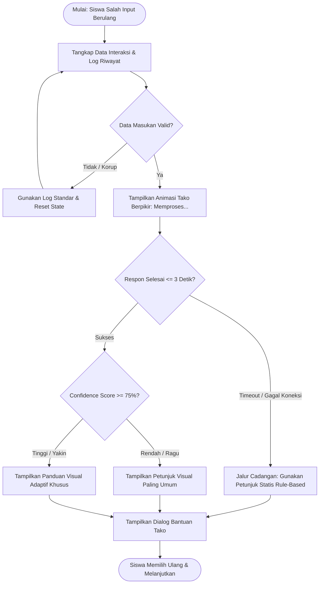

# Dokumen Kebutuhan Perangkat Lunak (Requirements Document): Game Edukasi *Daily Life*

Dokumen ini merupakan kompilasi terpadu hasil perancangan kebutuhan perangkat lunak (Tahap 1 hingga Tahap 5) untuk Game Edukasi *Daily Life* bagi anak disabilitas intelektual (tunagrahita). Dokumen ini berfungsi sebagai acuan perancangan arsitektur sistem, alur interaksi, dan skenario pengujian perangkat lunak.

---

## Tahap 1 — Draf User Stories (Prinsip INVEST & Prioritas MoSCoW)

### 1. Tabel User Story

| ID Story | Narasi User Story | FR Asal | Prioritas MoSCoW | Kategori |
| :--- | :--- | :--- | :--- | :--- |
| **US-01** | Sebagai siswa tunagrahita, saya ingin melihat pembuka cerita dan sapaan dari maskot Tako, agar saya mengerti awal mula cerita game sebelum mulai bermain. | FR-01 | Must | Fitur Inti |
| **US-02A** | Sebagai siswa tunagrahita, saya ingin menyelesaikan modul aktivitas kebersihan diri (Bangun Tidur, Mandi, Menggosok Gigi), agar saya bisa belajar membersihkan diri di pagi hari secara runtut. | FR-02 | Must | Fitur Inti |
| **US-02B** | Sebagai siswa tunagrahita, saya ingin menyelesaikan modul persiapan fisik dan perlengkapan (Memakai Seragam dan Menyiapkan Buku), agar saya siap berangkat ke sekolah. | FR-02 | Must | Fitur Inti |
| **US-02C** | Sebagai siswa tunagrahita, saya ingin menyelesaikan modul akhir (Sarapan dan Pamitan), agar rangkaian kegiatan pagi saya selesai dengan sempurna. | FR-02, FR-06, FR-07 | Must | Fitur Inti |
| **US-03** | Sebagai siswa tunagrahita, saya ingin pilihan langkah kegiatan saya dievaluasi secara otomatis, agar saya tahu apakah tindakan saya sudah benar. | FR-03 | Must | Fitur Inti |
| **US-04** | Sebagai siswa tunagrahita, saya ingin langsung berpindah ke aktivitas berikutnya saat pilihan saya benar, agar permainan terus berjalan lancar. | FR-04 | Must | Fitur Inti |
| **US-05** | Sebagai siswa tunagrahita, saya ingin mendapat panduan dan teguran dari Tako saat pilihan saya salah, agar saya bisa mencoba memperbaikinya. | FR-05 | Must | Fitur Inti |
| **US-06A** | Aspek AI: Sebagai siswa tunagrahita, saya ingin sistem mencatat pola frekuensi kesalahan saya pada setiap modul, agar sistem mengenali bagian mana yang paling sulit bagi saya. | FR-05, R2, R4, R6, R8, R10, R13 | Should | Fitur AI ★ |
| **US-06B** | Aspek AI: Sebagai siswa tunagrahita, saya ingin karakter Tako mengubah tingkat kejelasan petunjuk verbal/visual menjadi lebih sederhana jika saya melakukan kesalahan berulang, agar saya lebih mudah mengerti. | FR-05, R2, R4, R6, R8, R10, R13 | Should | Fitur AI ★ |
| **US-07** | Sebagai siswa tunagrahita, saya ingin memilih menu makanan sarapan yang tepat, agar saya bisa lanjut ke tahap persiapan berangkat sekolah. | FR-06 | Must | Fitur Inti |
| **US-08** | Sebagai siswa tunagrahita, saya ingin melihat layar selesai setelah berhasil melakukan pamitan, agar saya tahu bahwa misi pagi hari saya sudah tuntas. | FR-07 | Must | Fitur Inti |

### 2. Evaluasi Prinsip INVEST

* **US-01 (Opening Story & Maskot Tako)**
  * *Independent & Negotiable:* Dapat dikembangkan dan diuji secara terpisah dari modul game inti.
  * *Valuable:* Memberikan konteks awal yang ramah anak berkebutuhan khusus sebelum masuk ke materi inti.
  * *Estimable & Small:* Sangat kecil dan mudah diperkirakan durasi pengerjaannya.
  * *Testable:* Dapat diuji dengan memastikan dialog pengenalan karakter Tako muncul saat game dibuka.

* **US-02A, US-02B, & US-02C (Pecahan Modul Aktivitas Harian)**
  * *Independent:* Masing-masing kelompok modul dapat dikembangkan secara modular pada Unity Engine.
  * *Valuable:* Menjadi fondasi pembiasaan bina diri yang terstruktur tanpa membebani daya tangkap anak.
  * *Estimable & Small:* Berukuran pas untuk dikerjakan dalam siklus pengerjaan sprint reguler.
  * *Testable:* Dapat diuji dengan mengecek kesinambungan perpindahan scene antaraktivitas terkait.

* **US-03 & US-04 (Evaluasi Rule-Based dan Transisi Otomatis)**
  * *Independent & Negotiable:* Terhubung dengan modul aktivitas, namun fungsi logikanya independen untuk diuji.
  * *Valuable:* Menjamin simulasi interaktif berjalan tanpa distorsi atau ambiguitas logika.
  * *Estimable & Small:* Terukur dan dapat diimplementasikan dalam skrip percabangan logika C#.
  * *Testable:* Dapat diverifikasi dengan skenario black box testing (TC-01 s.d. TC-08).

* **US-05 (Umpan Balik Kesalahan dari Tako)**
  * *Independent:* Berdiri sendiri sebagai pengendali respon dialog karakter Tako.
  * *Valuable:* Mencegah frustrasi pada siswa tunagrahita saat memilih tindakan yang keliru.
  * *Estimable & Small:* Berukuran ringkas, terfokus pada kemunculan dialog dan pemutaran audio teguran.
  * *Testable:* Dapat diuji melalui injeksi input salah untuk memastikan kemunculan instruksi ulang.

* **US-06A & US-06B (Fitur AI Bimbingan Adaptif)**
  * *Independent:* Berfungsi sebagai lapisan penunjang keputusan adaptif di atas sistem rule-based.
  * *Valuable:* Menyesuaikan kecepatan belajar game dengan kebutuhan personal anak berkebutuhan khusus.
  * *Estimable & Small:* Pembagian menjadi pencatatan pola (US-06A) dan penyesuaian visual (US-06B) membuat cakupan tugas terukur.
  * *Testable:* Dapat diuji dengan mensimulasikan kegagalan berulang untuk mengamati perubahan derajat petunjuk.

* **US-07 & US-08 (Modul Sarapan dan Layar Selesai)**
  * *Independent & Negotiable:* Menjadi penutup skenario siklus pagi.
  * *Valuable:* Memberikan rasa tuntas dan pencapaian bagi pengguna setelah merampungkan seluruh rutinitas.
  * *Estimable & Small:* Komponen ringkas dengan cakupan kebutuhan yang sangat terdefinisi.
  * *Testable:* Dapat diuji dengan memilih menu sarapan benar dan memicu layar akhir permainan.

---

## Tahap 2 — Use Case & Skenario Eksepsi AI

### UC-01: Menganalisis Pola Kesalahan Belajar dan Menyesuaikan Umpan Balik Adaptif (Fitur AI ★)

* **Aktor Utama**: Siswa Tunagrahita
* **Aktor Pendukung**: Sistem *Rule-Based/Decision Tree*, Modul Logika AI Adaptif, Database Lokal/Server
* **Precondition**:
  * Pengguna berada di dalam salah satu modul aktivitas *Daily Life*.
  * Pengguna melakukan kesalahan input secara berulang ($\ge 2$ kali) pada modul terkait.
* **Postcondition**:
  * Sistem berhasil merekam log frekuensi kesalahan interaksi pengguna.
  * Karakter Tako menyajikan arahan atau isyarat visual adaptif yang lebih eksplisit untuk memandu penyelesaian tugas.

#### Alur Utama (*Main Flow*):
1. Pengguna memilih objek atau tindakan yang salah pada modul aktivitas yang sedang berjalan.
2. Sistem mendeteksi adanya input yang tidak sesuai dengan kondisi logika valid modul terkait.
3. Modul Logika AI Adaptif mencatat riwayat interaksi dan frekuensi kesalahan ke database lokal.
4. Sistem menghitung tingkat kesulitan belajar pengguna berdasarkan akumulasi pola kesalahan.
5. Sistem memicu modul AI untuk merumuskan petunjuk visual/verbal yang lebih disederhanakan.
6. Karakter Tako muncul dan menyajikan umpan balik adaptif yang disesuaikan kepada pengguna.
7. Pengguna menerima petunjuk baru tersebut dan mencoba kembali memilih tindakan yang tepat.

#### Alur Alternatif (*Alternative Flow*):
* **3a**. Pengguna memilih jawaban yang benar pada percobaan pertama atau kedua:
  * 1. Sistem mencatat bahwa pengguna telah memahami tugas dengan baik tanpa memerlukan asistensi khusus.
  * 2. Sistem mempertahankan standar interaksi normal dan melanjutkan alur ke aktivitas berikutnya (*LoadNextActivity*).

#### Alur Eksepsi Khusus AI (*AI Exception Flow*):
* **Kualitas masukan data rendah atau korup sebelum diproses**:
  * *Skenario*: Data riwayat interaksi layar mengalami anomali (*corrupted state*) sehingga format log gagal diurai modul AI.
  * *Penanganan*: Sistem mengabaikan rekaman data korup tersebut, menulis log penanganan senyap, dan menggunakan aturan statis (*fallback rule*) untuk memunculkan petunjuk default Tako tanpa memicu penghentian aplikasi (*softlock*).
* **Permintaan pemrosesan analitik AI mengalami timeout atau kegagalan koneksi**:
  * *Skenario*: Proses penentuan bimbingan adaptif memakan durasi melebihi batas latensi yang ditetapkan ($> 3$ detik).
  * *Penanganan*: Sistem membatalkan antrean komputasi AI, mengalihkan kendali secara instan ke sistem *Rule-Based* statis bawaan aplikasi (*offline fallback*), dan menampilkan bimbingan standar Tako agar pembelajaran tidak terjeda.
* **Skor keyakinan model berada di bawah ambang batas (*low confidence*)**:
  * *Skenario*: Pola kesalahan pengguna bersifat acak sehingga modul inferensi menghasilkan tingkat keyakinan rendah ($< 75\%$).
  * *Penanganan*: Sistem mengeksekusi tindakan mitigasi aman dengan menyajikan petunjuk visual umum yang paling mendasar serta meminta pengguna melakukan pemilihan ulang.

#### Kaitan Kebutuhan:
* **User Story**: US-06A dan US-06B
* **Functional Requirements**: FR-05, R2, R4, R6, R8, R10, R13

---

## Tahap 3 — User Flow dengan Status AI

### 1. Langkah Alur Pengguna Terstruktur

#### A. Alur Fitur AI ★: Bimbingan Adaptif Evaluasi Kesalahan (UC-01)
1. **Titik Masuk (*Entry Point*)**: Siswa berada pada layar salah satu modul (contoh: Menyiapkan Buku Sekolah).
2. **Interaksi Input**: Siswa mengetuk objek di layar secara keliru berturut-turut ($\ge 2$ kali).
3. **Pengecekan di Perangkat (*Local Validation*)**: Sistem memvalidasi ketukan tepat pada area interaktif serta memverifikasi keterbacaan data log lokal.
4. **Pemrosesan Inferensi**: Sistem memicu evaluasi analitik pola kesalahan untuk menentukan format umpan balik yang relevan.
5. **Penyajian Respons**:
   - Jika *confidence* tinggi ($\ge 75\%$): Tako menyajikan isyarat visual spesifik (misal: efek pendaran/*glow* pada objek yang tepat).
   - Jika *confidence* rendah ($< 75\%$): Tako menyajikan petunjuk dasar umum dan meminta anak/pendamping mencoba kembali.
   - Jika *timeout/gagal*: Sistem langsung menjalankan *fallback* logika statis *rule-based*.
6. **Titik Selesai (*Exit Point*)**: Siswa memahami arahan, memilih objek yang benar, dan melanjutkan aktivitas.

#### B. Alur Fitur Utama: Siklus Mandiri Rutinitas Harian
1. **Titik Masuk**: Siswa memasuki aktivitas baru pasca-menyelesaikan tahap sebelumnya.
2. **Interaksi Input**: Siswa menyentuh objek tindakan yang sesuai dengan skenario pagi (contoh: memilih sabun untuk mandi).
3. **Evaluasi Aturan (*Rule Evaluation*)**: Unity Engine mengeksekusi logika *Decision Tree* statis.
4. **Umpan Balik Instan**: Sistem memutar audio afirmatif dan memicu transisi ke modul berikutnya (*LoadNextActivity*).
5. **Titik Selesai**: Permainan berpindah ke modul berikutnya secara mulus.

### 2. Penggambaran 4 Status Sistem

| Status Sistem | Fitur AI ★ (Bimbingan Adaptif Tako) | Fitur Utama (Siklus Mandiri Harian) |
| :--- | :--- | :--- |
| **1. Validasi Awal di Perangkat** | Memvalidasi sentuhan pada objek interaktif kanvas dan memverifikasi integritas log riwayat sebelum dikirim ke modul analitik. | Memvalidasi bahwa sentuhan berada pada elemen permainan yang sah (bukan bidang latar belakang kosong). |
| **2. Indikator Proses** | Animasi karakter Tako berpikir (*thinking animation* tanpa teks rumit) agar anak tidak merasa game mengalami freeze/macet. | Transisi visual mikro (penekanan tombol/efek sorot seketika) saat mengeksekusi logika kondisi. |
| **3. Penanganan Hasil** | • **Yakin ($\ge 75\%$):** Menyajikan isyarat visual terarah (tangan menunjuk objek yang tepat). • **Ragu ($< 75\%$):** Menyajikan petunjuk dasar umum terstandar. | Masukan bernilai benar langsung memicu pemuatan scene baru; masukan keliru memicu dialog koreksi standar Tako. |
| **4. Jalur Cadangan (*Fallback*)** | Jika komputasi AI melampaui $3$ detik, sistem memutus antrean dan mengeksekusi dialog panduan statis *Rule-Based*. | Jika pemuatan aset modul berikutnya terkendala, scene dimuat ulang (*reload*) tanpa menghapus status progres. |

### 3. Diagram Alur (Mermaid Flowchart)

#### Diagram Alur Fitur AI ★: Evaluasi Adaptif Bimbingan Kesalahan

# Tahap 4 - (Given–When–Then)

Dokumen ini mendefinisikan *Acceptance Criteria* (AC) menggunakan format BDD (*Behavior-Driven Development*) dengan pola Given–When–Then untuk menguji kelayakan setiap User Story prioritas. Kriteria pengujian berpatokan pada batas waktu respon sistem ($\le 3$ detik), ketepatan evaluasi aturan logika, dan keandalan mitigasi fitur berbasis AI ★.

---

## 1. Acceptance Criteria: Fitur Inti (Core Features)

### US-01: Pembuka Cerita dan Dialog Karakter Tako
* **Metode Uji**: *User Interface Test* / *Functional Black Box Testing*

#### Scenario 1: Menampilkan pembuka cerita saat game pertama kali dijalankan (Happy Path)
* **Given** aplikasi telah terpasang dan dibuka untuk pertama kali pada perangkat Android
* **When** proses pemuatan awal (*loading splash screen*) selesai dalam waktu $\le 2$ detik
* **Then** sistem menampilkan karakter pemandu Tako beserta balon dialog perkenalan di layar tanpa *glitch* visual.

---

### US-02A: Penyelesaian Modul Aktivitas Kebersihan Diri
* **Metode Uji**: *Integration Test*

#### Scenario 1: Transisi runtut dari modul Bangun Tidur ke Mandi
* **Given** pengguna berada pada modul Bangun Tidur dan telah memilih tindakan yang benar
* **When** sistem memvalidasi logika `R1` bernilai benar
* **Then** sistem memuat *scene* Mandi dalam waktu $\le 1,5$ detik tanpa terjadinya *softlock*.

#### Scenario 2: Pengulangan modul jika pengguna salah memilih perlengkapan mandi
* **Given** pengguna berada pada modul Mandi
* **When** pengguna memilih objek yang salah (misal: memilih buku alih-alih sabun)
* **Then** sistem menjalankan aturan `R4`, karakter Tako muncul memberikan teguran, dan status pengguna tetap berada di *scene* Mandi.

---

### US-02B: Penyelesaian Modul Persiapan Seragam dan Buku
* **Metode Uji**: *Functional Black Box Testing*

#### Scenario 1: Memasukkan buku dan alat tulis ke dalam tas sekolah dengan benar
* **Given** pengguna berada pada modul Menyiapkan Buku
* **When** pengguna memilih semua perlengkapan alat tulis yang sesuai jadwal sekolah
* **Then** sistem mengeksekusi aturan `R9` dan langsung mengarahkan pengguna ke *scene* Sarapan dalam durasi $\le 2$ detik.

---

### US-02C & US-07: Pemilihan Menu Sarapan dan Transisi ke Pamitan
* **Metode Uji**: *Functional Black Box Testing*

#### Scenario 1: Memilih menu sarapan yang sehat dan sesuai
* **Given** pengguna berada pada modul Sarapan
* **When** pengguna memilih makanan yang valid (sarapan pagi)
* **Then** sistem mengeksekusi aturan `R11` dan membuka modul Pamitan.

#### Scenario 2: Memilih makanan atau benda yang tidak sesuai pada saat sarapan
* **Given** pengguna berada pada modul Sarapan
* **When** pengguna memilih objek bukan makanan sarapan
* **Then** sistem menampilkan dialog koreksi Tako dan meminta pengguna memilih ulang tanpa mengurangi poin permainan.

---

### US-08: Siklus Permainan Berakhir pada Modul Pamitan
* **Metode Uji**: *End-to-End (E2E) User Acceptance Test*

#### Scenario 1: Pengguna menyelesaikan aksi pamitan kepada orang tua
* **Given** pengguna telah menyelesaikan seluruh modul 1 hingga 6 secara runtut
* **When** pengguna memilih opsi pamitan dengan benar pada modul ke-7
* **Then** sistem mengeksekusi aturan `R12`, mengubah *state* permainan menjadi `Selesai`, dan menampilkan layar penutup/selamat dalam waktu $\le 1$ detik.

---

## 2. Acceptance Criteria: Fitur AI Bimbingan Adaptif (Fitur AI ★)

### US-06A & US-06B: Analisis Pola Kesalahan dan Adaptasi Umpan Balik Tako
* **Metode Uji**: *Integration Test* & *Simulated Fault Injection Testing*

#### Scenario 1: Bimbingan adaptif aktif saat kesalahan berulang dengan keyakinan tinggi (Happy Path)
* **Given** pengguna melakukan kesalahan input $\ge 2$ kali berturut-turut pada modul yang sama
* **When** modul AI memproses log kesalahan dan menghasilkan skor keyakinan (*confidence score*) $\ge 75\%$ dalam durasi $\le 3$ detik
* **Then** karakter Tako menampilkan dialog petunjuk visual spesifik yang lebih sederhana (sorotan/animasi penunjuk objek yang benar) pada layar.

#### Scenario 2: Data interaksi layar tidak lengkap atau korup (Edge Case)
* **Given** perangkat pengguna mengalami gangguan memori lokal sehingga data riwayat sentuhan rusak (*corrupted input*)
* **When** sistem memvalidasi kelayakan data masukan sebelum diproses oleh modul analitik AI
* **Then** sistem mengabaikan data yang rusak tersebut, mencatat *error log* tanpa menutup aplikasi (*crash*), dan menampilkan pesan bimbingan statis *Rule-Based* standar dari Tako.

#### Scenario 3: Pemrosesan AI mengalami latensi tinggi atau kegagalan koneksi (Failure Path / Timeout)
* **Given** modul inferensi analitik AI belum memberikan hasil setelah waktu pemrosesan berjalan $> 3$ detik
* **When** batas waktu toleransi latensi (*timeout*) tercapai
* **Then** sistem otomatis menghentikan proses antrean AI, beralih ke jalur cadangan (*fallback* logika *Rule-Based* lokal), dan memunculkan petunjuk default Tako agar permainan tidak macet (*freeze*).

#### Scenario 4: Skor keyakinan modul AI berada di bawah ambang batas (Low Confidence)
* **Given** pengguna melakukan kesalahan dengan pola acak sehingga modul AI menghasilkan *confidence score* $< 75\%$
* **When** modul AI mengembalikan status hasil analitik meragukan
* **Then** sistem mengeksekusi penanganan mitigasi aman dengan menyajikan petunjuk umum dasar secara repetitif dan meminta konfirmasi tindakan ulang kepada pengguna.

---

## 3. Matriks Kesiapan Pengujian (Test Readiness Matrix)

| ID User Story | ID Skenario | Jenis Skenario | Metode Pengujian | Target Metrik / Batas Toleransi |
| :--- | :--- | :--- | :--- | :--- |
| **US-01** | SC-01.1 | Normal (Happy Path) | UI & Functional Test | Pemuatan awal $\le 2$ detik |
| **US-02A** | SC-02A.1 | Normal (Happy Path) | Integration Test | Waktu transisi $\le 1,5$ detik |
| **US-02A** | SC-02A.2 | Alur Negatif | Functional Test | Dialog muncul instan, *zero freeze* |
| **US-02B** | SC-02B.1 | Normal (Happy Path) | Functional Test | Transisi *scene* $\le 2$ detik |
| **US-02C** | SC-07.1 | Normal (Happy Path) | Functional Test | Respon evaluasi $\le 1$ detik |
| **US-08** | SC-08.1 | Normal (End State) | E2E Acceptance Test | Tampil layar tamat $\le 1$ detik |
| **US-06A/B** | SC-06.1 | Normal (Happy Path AI) | Integration Test | *Latency* $\le 3$ detik, *Confidence* $\ge 75\%$ |
| **US-06A/B** | SC-06.2 | Data Masukan Batas (*Edge*) | Unit / Integrity Test | Validasi data gagal $\rightarrow$ fallback senyap |
| **US-06A/B** | SC-06.3 | Kegagalan Respon (*Timeout*) | Fault Injection Test | Batas waktu cut-off tepat 3 detik $\rightarrow$ fallback lokal |
| **US-06A/B** | SC-06.4 | *Low Confidence* | Logic & Scenario Test | *Confidence* $< 75\%$ $\rightarrow$ petunjuk aman umum |
